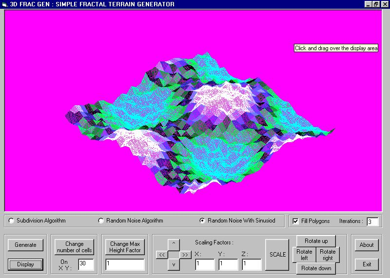



## A 3D fractal  Terrain / Landscape Generator

### Description

This is a simple, yet powerful 3D fractal terrain landscape generator in VB. includes, Heightmapping, Subdivision, Random noise, colour shading,etc
 
### More Info
 

             |
---                |---
**Submitted On**   |2004-11-19 22:52:54
**By**             |[Aniruddha Marathe](https://github.com/Planet-Source-Code/PSCIndex/blob/master/ByAuthor/aniruddha-marathe.md)
**Level**          |Advanced
**User Rating**    |4.2 (21 globes from 5 users)
**Compatibility**  |VB 6\.0
**Category**       |[Graphics](https://github.com/Planet-Source-Code/PSCIndex/blob/master/ByCategory/graphics__1-46.md)
**World**          |[Visual Basic](https://github.com/Planet-Source-Code/PSCIndex/blob/master/ByWorld/visual-basic.md)
**Archive File**   |[A\_3D\_fract18203911202004\.zip](https://github.com/Planet-Source-Code/aniruddha-marathe-a-3d-fractal-terrain-landscape-generator__1-57343/archive/master.zip)

